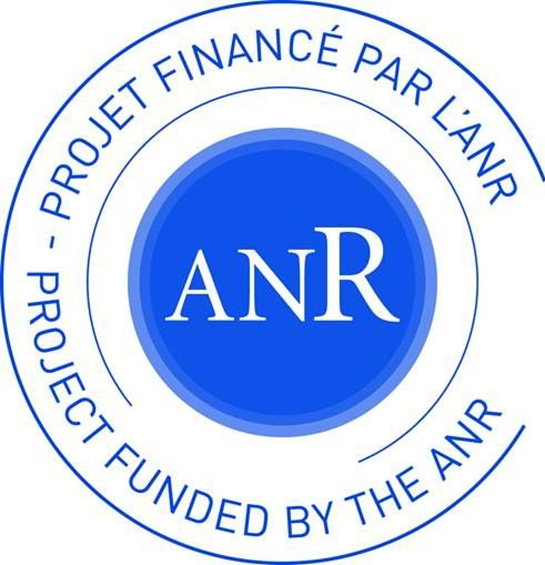

# VesselVerse DVC Annotations Repository


## Overview

This repository contains the complete collection of multi-expert brain vessel annotations from the VesselVerse dataset, managed through Data Version Control (DVC) for reproducible and collaborative vessel segmentation research. Following the methodology presented in "VesselVerse: A Dataset and Collaborative Framework for Vessel Annotation" (MICCAI 2025), this repository implements a comprehensive annotation management system with version control, consensus generation, and quality assurance mechanisms.

## Data Access

We've recently updated our distribution process to better serve the research community. The dataset is now released upon completion of a request form rather than being directly downloadable. This approach helps us understand how VesselVerse is being used and ensures proper acknowledgment in publications.

**To request access:** Please send an email to Maria A. Zuluaga at [maria.zuluaga@eurecom.fr](mailto:maria.zuluaga@eurecom.fr) with:
- Your name and institutional affiliation
- A brief description of your intended use

## Repository Contents

### Annotation Collection
- **950 annotated brain vessel images** across three public datasets (IXI, TubeTK, TopCoW)
- **Multiple imaging modalities**: TOF-MRA, T1-MRA, and CTA
- **Up to 9 expert annotations per image**, including:
  - Manual annotations (MA) by expert annotators
  - Frangi filter-based segmentations (FF)
  - Deep learning model outputs (nnU-Net, A2V, SPOCKMIP, VesselBoost, JOB-VS, StochasticBatchAL)
  - STAPLE-based consensus annotations (CA)

### Version Control Framework
- **DVC-managed annotation tracking** with complete provenance
- **Hierarchical storage system** organizing images, expert annotations, and metadata
- **Metadata tracking** for spatial properties, expert credentials, and data integrity

### Multi-Expert Annotation Support
- **Protocol-agnostic design** accommodating diverse annotation standards
- **Expert identification system** with unique keys for each annotator/model
- **Consensus generation tools** using STAPLE expectation-maximization algorithm
- **Inter-rater agreement metrics** for annotation quality assessment

## Dataset Structure

```
annotations/
├── IXI_dataset/
│   ├── TOF_MRA/
│   │   ├── expert_annotations/
│   │   │   ├── manual_expert_1/
│   │   │   ├── frangi_filter/
│   │   │   ├── nnunet_model/
│   │   │   ├── a2v_model/
│   │   │   └── consensus_staple/
│   │   └── metadata/
│   └── quality_metrics/
├── TubeTK_dataset/
│   └── T1_MRA/
│       ├── expert_annotations/
│       └── metadata/
├── TopCoW_dataset/
│   ├── MRA/
│   └── CTA/
├── consensus_annotations/
└── annotation_protocols/
```

## Key Features

### Version Control & Reproducibility
- **Complete annotation history** with commit-level tracking
- **Rollback capabilities** for error correction and refinement
- **Branching support** for experimental annotation protocols
- **Reproducible consensus generation** with deterministic STAPLE parameters

### Collaborative Framework
- **Multi-institutional contributions** from experts across France, Italy, and UK
- **Expert credential tracking** with institutional affiliations
- **Contribution attribution** maintaining academic citation standards
- **Conflict resolution mechanisms** for annotation discrepancies

## Technical Specifications

### Annotation Formats
- **NIFTI format** (.nii.gz) for 3D volume annotations
- **Binary segmentation masks** with vessel/background labels
- **JSON metadata** containing annotation parameters and provenance
- **CSV quality metrics** with inter-rater agreement scores

### DVC Configuration
- **Remote storage integration** for large annotation files
- **Pipeline definitions** for consensus generation and validation
- **Parameter tracking** for model-generated annotations
- **Dependency management** between annotation versions

### Consensus Generation
- **STAPLE algorithm implementation** with sensitivity/specificity estimation
- **Expectation-maximization convergence** with configurable thresholds
- **Probabilistic annotation maps** for uncertainty quantification
- **Automated consensus thresholding** based on expert performance weights

## Usage Instructions

### Accessing Annotations
```bash
# Clone repository with DVC
git clone <repository-url>
cd vesselverse-annotations

# Pull all annotation data
dvc pull

# Access specific dataset annotations
dvc pull annotations/IXI_dataset.dvc
```

### Generating Consensus Annotations
```bash
# Generate STAPLE consensus for specific image
dvc repro consensus_pipeline --force-downstream

### Contributing New Annotations
```bash
# Add new expert annotation
dvc add annotations/new_expert/
git add annotations/new_expert.dvc
git commit -m "Add expert annotations from [Institution]"
dvc push
```

## Citation

If you use these annotations in your research, please cite:

```bibtex
@InProceedings{ FalDan_VesselVerse_MICCAI2025,
                 author = { Falcetta, Daniele and Marciano, Vincenzo and Yang, Kaiyuan and Cleary, Jon and Legris, Loïc and Rizzaro, Massimiliano Domenico and Pitsiorlas, Ioannis and Chaptoukaev, Hava and Lemasson, Benjamin and Menze, Bjoern and Zuluaga, Maria A. },
                 title = { { VesselVerse: A Dataset and Collaborative Framework for Vessel Annotation } }, 
                 booktitle = {Medical Image Computing and Computer Assisted Intervention -- MICCAI 2025},
                 year = {2025},
                 publisher = {Springer Nature Switzerland},
                 volume = { LNCS 15972 },
                 month = {October},
                 pages = { 656 -- 666 },
              }
```

## Contributing

We welcome contributions of new annotations, protocol refinements, and quality improvements. Please:
1. **Follow annotation protocols** documented in `docs/annotation_guidelines.md`
2. **Ensure format compliance** using basic validation tools (advanced quality control in development)
3. **Submit pull requests** with detailed metadata and expert credentials
4. **Maintain reproducibility** through proper DVC versioning

**Note**: Comprehensive quality control mechanisms are currently under development. Current validation focuses on format compliance and metadata consistency.

## License

This repository is licensed under the MIT License. See `LICENSE` file for details.

## Acknowledgments

This work is supported by:
- ANR JCJC project I-VESSEG (22-CE45-0015-01)
- 3IA Côte d'Azur Investments project (ANR-23-IACL-0001)
- ERC CoG CARAVEL (101171357)
- Helmut Horten Foundation
- France Life Imaging (ANR-11-INBS-0006)

## Contact

For questions about annotations, data access, or collaboration opportunities:
- **Primary Contact**: Daniele Falcetta (daniele.falcetta@eurecom.fr) - Maria A. Zuluaga (maria.zuluaga@eurecom.fr)
- **Data Access**: Maria A. Zuluaga (maria.zuluaga@eurecom.fr)
- **Technical Support**: Daniele Falcetta (daniele.falcetta@eurecom.fr)
- **Project Website**: https://i-vesseg.github.io/vesselverse/

---

**Note**: This repository contains annotation data only. Original medical images must be obtained from their respective sources (IXI, TubeTK, TopCoW datasets) following their individual licensing terms.

<table align="center">
  <tr>
      <td>
      
    </td>
    <td>
      
    </td>
        <td>
      
    </td>
  </tr>
</table>
